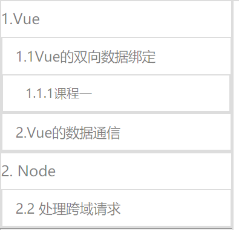

# 项目背景
不论在任何学习过程中，一个知识长久不拿起来就会容易忘记，当再次用到的话，往往要回忆许久，这个时候就看出来在学习过程中总结的知识体系的重要性，遂开发了这个视频播放器，用来记录学习过程中较难以用文本整理的知识点，以结合github的文字知识总结，来完善前端知识体系同时提高复习和学习的效率。
# 播放器功能
左侧为视频列表，右侧为视频区域，当点击左侧列表区域的时候，右侧视频区域即可播放相应的视频，视频可进行音量调节、全屏/退出全屏、倍速播放等操作。
# 项目收获
## 1. 树形组件
### 1.1 项目概述 
页面的左侧目录采用了树形结构，其Html基本结构为：

```html
<!-- 树形基本结构块 -->
<ul>
    <a href="#">一级标题</a>
    <li>一、我是一级标题的内容一</li>
    <li>二、我是一级标题的内容二</li>
</ul>
<!-- 如果一级标题下有二级标题，则在一级标题的li中再次嵌套树形基本结构块 -->
<ul>
    <a href="#">一级标题</a>
    <li>一、我是一级标题的内容一</li>
    <li>二、我是一级标题的内容二</li>
    <li>
        <!-- 嵌套基本树形结构块 -->
        <ul>
            <a href="#">一级标题</a>
            <li>一、我是一级标题的内容一</li>
            <li>二、我是一级标题的内容二</li>
        </ul>
        <!-- 树形结构快嵌套结束 -->
    </li>
</ul>
```
当有了好的HTML结构时，JS部分的操作才会变得更加高效：

```javascript
// 动态生成目录结构
// 由于我不是要完成简单的树形组件，我还要点击某树形组件，更新右侧的视频，所以，手动添加树形结构费时费力，并且可复用度不高，于是就采用了JS动态生成的方式

// 下面是基本的数据结构

// 将所有的视频列表放到一个数组里面
// 数组的每一项都是一个对象
// 每一个对象有三个属性:type url/path children:[]

// 本来计划是如果type 是 video，就播放视频，如果type 是github，就调到相应的github上的知识点 ，但后来发现github有限制，靠iframe不能够实现，遂type类型为github的就先放置了

// path/url 是视频/github页的路径

// children 为一个数组，其结构和父级结构是一样的，用于存放下一级视频列表
let treeDemo = [{
    name: ' 1.Vue',
    children: [{
            name: ' 1.1Vue的双向数据绑定',
            children: [{
                name: ' 1.1.1课程一',
                type:'video',
                path:'./player/jj.mp4'
            }]
        }, {
            name: '2.Vue的数据通信'
        }
    ]
}, {
    name: '2. Node',
    children:[
        {
            name:'2.1 建立服务器',
            type:'github',
            url:'github/GUMEIK'
        },
        {name:'2.2 处理跨域请求'}
    ]
}]
// 先开一下预计渲染的效果，再往下进行思路展开
```


```javascript
// ----进行结构渲染
// 此部分应该是本项目最难处理的部分
// 下面就是根据数据渲染树形组件结构并给结构添加属性
// render 函数返回的是生成好的结构的字符串

// 很明显用到了递归
function render(data) {
    if (data == null || data.length == 0) return;
    let str = '';
    for (let i = 0; i < data.length; i++) {
        // 如果存在孩子节点，就再次进行拼接
        if (data[i].children && data[i].children != undefined) {
            let temp = render(data[i].children);
            let type = '';
            var path = '';
            if(data[i]['type'] != undefined){
                if(data[i].path != undefined){
                    path = data[i].path;
                    str += `<ul><li><a href="#" data-type=${type} data-path=${path}>${data[i].name}</a>${temp}</li></ul>`;
                }
            }else{
                str += `<ul><li><a href="#" data-type=${type} >${data[i].name}</a>${temp}</li></ul>`;
            }
        } else {
            // 如果不存在孩子节点，就不拼接temp了
            if(data[i]['type'] != undefined){
                if(data[i].path != undefined){
                    path = data[i].path;
                    str += `<ul><li><a href="#" data-path=${path}>${data[i].name}</a></li></ul>`;
                }
            }else{
                str += `<ul><li><a href="#" >${data[i].name}</a></li></ul>`
            }
        }
    }
    return str;
}


// 将生成好的str插入到html结构当中
// 进行树形组件展开合并的操作：

// 传入放置属性组件的容器
function setMenuList(container) {
    let oUl = container.getElementsByTagName('ul');
    for (let i = 0; i < oUl.length; i++) {
        let oA = oUl[i].getElementsByTagName('a')[0];
        let childUl = oUl[i].getElementsByTagName('ul');
        oA.onclick = function () {
            for (let i = 0; i < childUl.length; i++) {
                let show = childUl[i].style.display == 'none' ? true : false;
                if (show) {
                    childUl[i].style.display = 'block';
                } else {
                    childUl[i].style.display = 'none';
                }
                // 点击带有视频的，就跳转           
            }
            if(oA.dataset.path && oA.dataset.path != undefined){
                // changeVideo为一个函数，改变要video的src属性
                changeVideo(oA.dataset.path);
            }
        }
    }
}
```
### 1.2 项目总结
此部分功能的完成度还是比较高的，有缺憾的地方就是列表的样式需要自己独立写css来进行设置，这是不足的地方，也是接下来要努力改进的地方。
## 2. 阿里巴巴矢量图标库
了解并使用到阿里巴巴矢量图标库，要注意的一点是：当往项目里添加了新图标时，链接就会发生改变，此时就需要复制新的连接并引入
## 3. H5视频播放器
### 3.1 相关API汇总
- video.paused 其值为布尔值，判断视频是否处于暂停状态
- video.play 播放视频
- video.pause 暂停视频
- video.duration 得到视频总时长
- video.currentTime 得到视频当前市场(也就是已经播放的部分时长)
- video.playbackRate 设置倍速
- video.volume 设置音量，其值为 0 - 1，可配合input type = range 输入框进行使用
- video.ondurationchange 视频总时长发生变化时触发的事件，可以在这个事件里面获取总时长，不能直接在这个事件的外部获取总时长，因为JS执行的时候，视频可能还没有加载完成。
- video.ontimeupdate 当视频已经播放部分时长发生改变时触发，不过其触发是有频率限制的，所以在进行拖动进度条事件不能依靠此事件，因为其频率达不到，就会出现卡顿的情况。
- document.fullscreen 查看是否处于全屏状态，其值为布尔值
- document.exitFullscreen() 退出全屏
- videoContainer.requestFullscreen() 进入全屏
- videoContainer.onfullscreenchange 监听容器全屏和非全屏状态的改变
- let rect = dom.getBoundingClientRect();得到一个元素的矩形区域
### 3.2 总结
越是细节之处越是难以处理:
- 当进入全屏状态以后，隔一段时间后要使底部状态栏消失，鼠标移动，底部状态栏再次显示
```javascript
var timer;
// 全屏状态下，一段时间过后隐藏工具条
function hideBar() {
    toobar.style.opacity = 1;
    progressbar.style.opacity = 1;
    modal.style.cursor = 'pointer';
    if (timer) {
        clearTimeout(timer);
    }
    timer = setTimeout(function () {
        toobar.style.opacity = '0';
        progressbar.style.opacity = 0;
        modal.style.cursor = 'none';
    }, 2000)
}
```
## 4. 其他
等有时间了，把这个做成一个Vue组件。